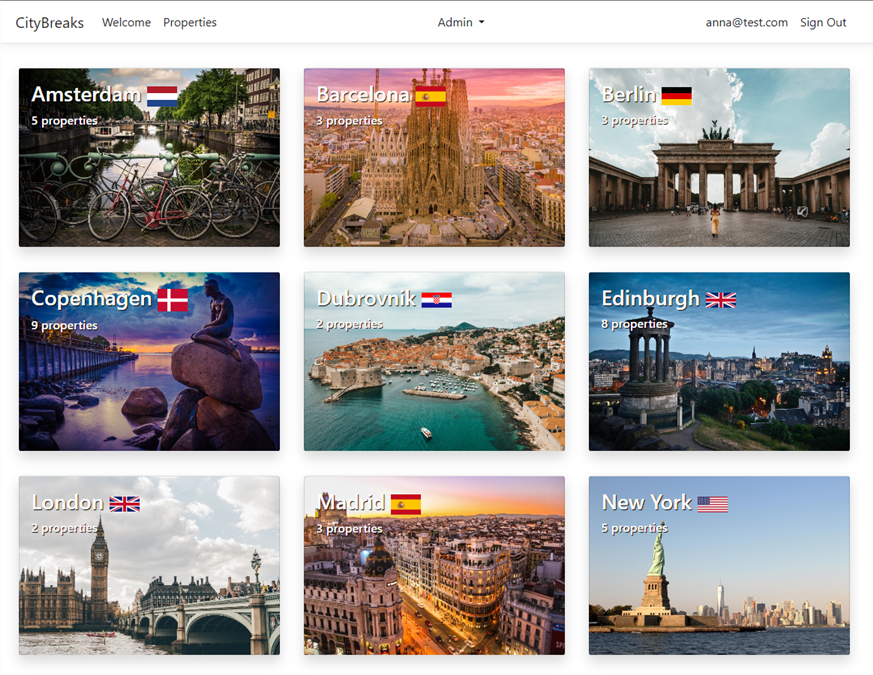

# ASP.NET Core Razor Pages Book

Based on the Web Application built in the Book 'ASP.NET Core Razor Pages in Action' by Mike Brind (Manning, 2022).

City Breaks is a web application for booking short holidays. It covers the topics of using forms and working with data,
securing your application and ensuring that it performs well before publishing it.

## Prerequisites

- Visual Studio 2022

## Getting started

1. Clone the project.
1. Open the solution file `src\CityBreaks.sln`.
1. Build the solution.
1. Press F5 to start the application.

## Screens

## License

[MIT License](./LICENSE)

Copyright &copy; 2022 Felipe Romero
